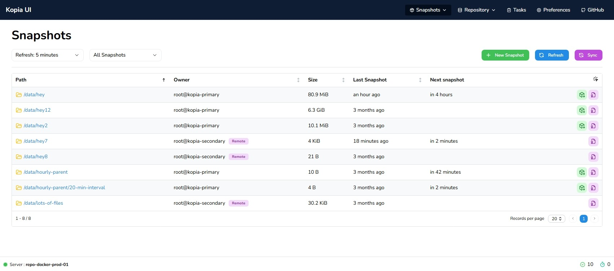
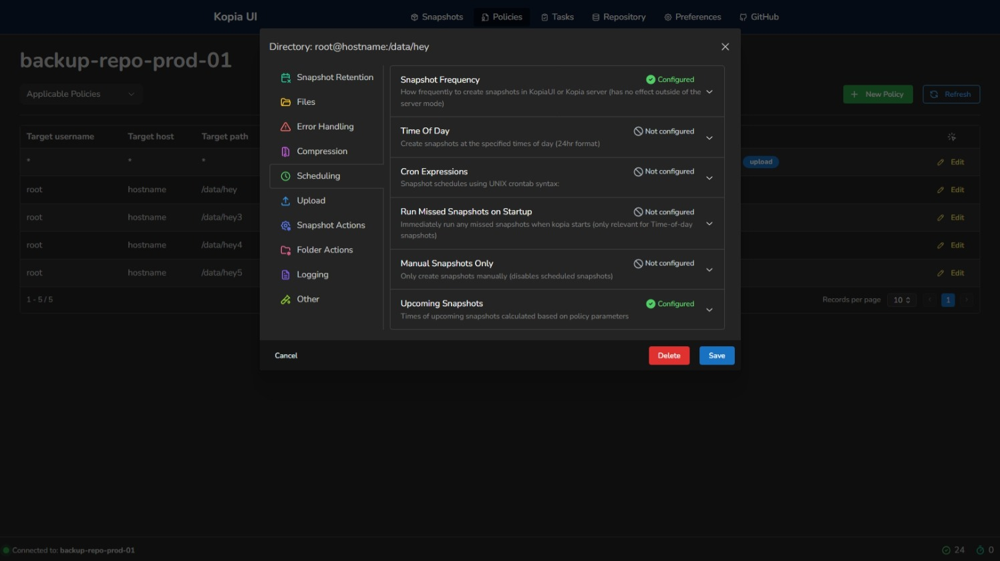
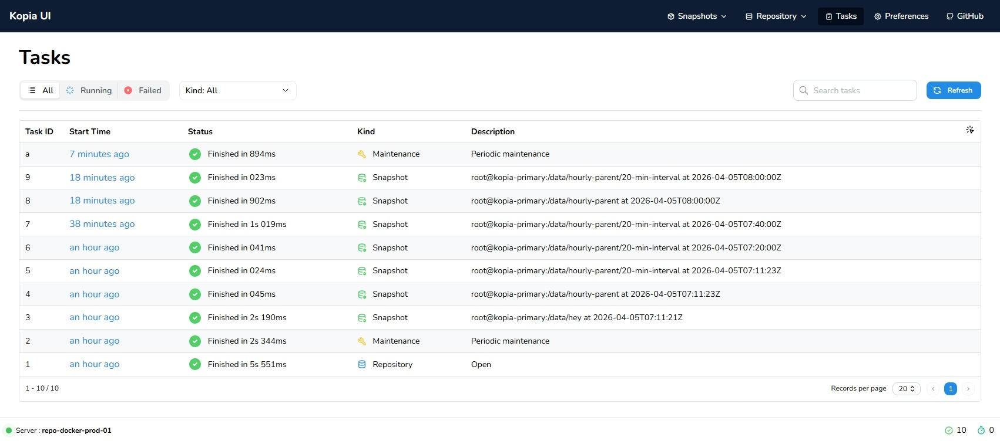

<a id="readme-top"></a>

<div align="center">
  <!-- <a href="https://github.com/joachimdalen/kopia-alternate-ui">
    
  </a> -->

  <h1 align="center">Kopia Alternate UI</h1>

  <p align="center">
    This project provides a dropin replacement for the original KopiaUI!
  </p>
</div>

> [!IMPORTANT]
> Kopia Alternate UI is not affiliated with or endorsed by the Kopia developers.

<!-- ABOUT THE PROJECT -->

## About The Project

> [!CAUTION]
> This project is under active development, even though it might be a while between commits. There is currently a bunch of features implemented, but also a lot missing. You will have to jump between the original UI and this to do full configuration.

I wanted a cleaner and easier to use UI for Kopia than the offical one. There are also some features I want to implement that is not in the official UI.

If this project helped you or you are interested in using it, please consider giving it a ⭐️! It's the only way I will be able to see the usage of this tool and how much time should be spent improving/finishing it.

|                                       |                                  |
| ------------------------------------- | -------------------------------- |
|      |  |
|  |     |

## Getting Started

This section will be extended as the project reaches a more complete state, but it works fine when running it locally for noe.

Add a new `.env` file with the following values and update as fitting to your setup

```env
KAU_KOPIA_ENDPOINT=http://localhost:51515
KAU_KOPIA_USERNAME=USERNAME
KAU_KOPIA_PASSWORD=SECRET_PASSWORD
```

These values are used in `vite.config.ts` to setup a proxy that handles authentication.

## License

Distributed under the Apache License 2.0 License. See `LICENSE` for more information.

<p align="right">(<a href="#readme-top">back to top</a>)</p>

<!-- ```yml
services:
  kopiaaltui:
    conatiner_name: kopia-alt-ui
    image: <github>/joachimdalen/kopia-alt-ui:v5
    ports:
      - 8080:80
    environment:
      # This endpoint should be reachable by the host
      - KAU_KOPIA_ENDPOINT=http://host.docker.internal:51515
``` -->
