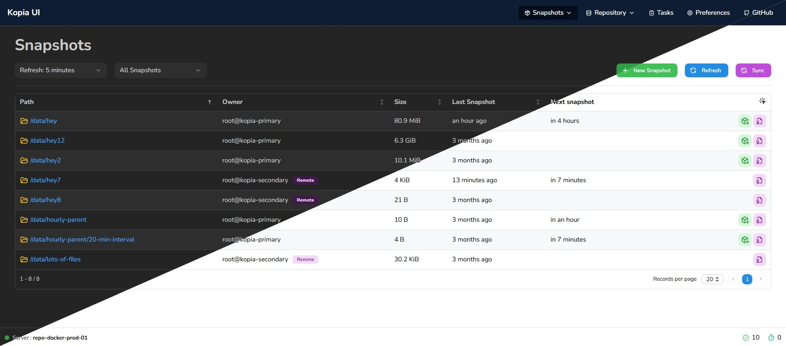

<a id="readme-top"></a>

<div align="center">
  <!-- <a href="https://github.com/joachimdalen/kopia-alternate-ui">
    
  </a> -->

  <h1 align="center">Kopia Alternate UI</h1>

  <p align="center">
    This project provides a dropin replacement for the original KopiaUI!
  </p>
</div>

> [!IMPORTANT]
> Kopia Alternate UI is not affiliated with or endorsed by the Kopia developers.

<!-- ABOUT THE PROJECT -->

## About The Project



> [!CAUTION]
> This project is under active development, even though it might be a while between commits. It should be mostly operational, but usage will determine potential bugs. Please see the [feature mapping](https://github.com/joachimdalen/kopia-alternate-ui/issues/5) issue for progress on implementing existing features.

I wanted a cleaner and easier to use UI for Kopia than the offical one. There are also some features I want to implement that is not in the official UI, such as multi server interaction, improved statistics and more.

>If this project helped you or you are interested in using it, please consider giving it a ⭐️! It's the only way I will be able to see the usage of this tool and how much time should be spent improving/finishing it.

## Features

- 🎨 Clean UI
- 🇳🇴 Localized (Currently supports English and Norwegain)
- 🖥️ Multi repository server support

## Getting Started

### Configure

The support for multiple servers must currently be configured manually. We have an issue []() to have this happen automatically when the container start, and that feature will be implemented later on.

1. Create a new json file. For examples we will use `instances.json`. This file will contains all the instances you should be able to switch between.

```json
[
  {
    "id": "primary",
    "name": "docker-primary-01",
    "default": true
  },
  {
    "id": "secondary",
    "name": "docker-secondary-01",
    "default": false
  }
]
```

- `id`: Should be unique across all instances. This is the key we will route the Nginx proxy based on.
- `name`: The display name used in the dropdown in the UI
- `default`: When `true`, will be the default selected instances in the UI

2. Use the [example `nginx.conf`](./docker/nginx.conf) as a reference and add new location blocks for your instances (You can remove the example `primary` and `secondary` blocks). During this step you will also need to decide how you want to authenticate aginst the servers. Please see [Authenticating to servers](#authenticating-to-servers) for more information.

```nginx
location /api/[INSTANCE-ID] {
  rewrite ^/api/[INSTANCE-ID]/(.*) /api/$1 break;
  proxy_pass https://[DOCKER-CONTAINER]:51515;

  # --- AUTH OPTION TWO ---
  proxy_hide_header WWW-Authenticate;
  # --- AUTH OPTION TWO END ---

  # --- AUTH OPTION THREE ---
  proxy_hide_header WWW-Authenticate;
  proxy_set_header Authorization "Basic ${INSTANCE_AUTH}";
  proxy_pass_header Authorization;
  # --- AUTH OPTION THREE END ---

  expires -1;
}
```

> [!IMPORTANT]
> Currently the container is using a Nginx templating feature. This means you will have to re-create the container for changes to apply. An update will come later that will ensure you can only restart the container for changes to take effect.

3. Mount the `instances.json` file and your custom `nginx.conf` file to the container

```yml
services:
  kopiaaltui:
    conatiner_name: kopia-ui
    image: ghcr.io/joachimdalen/kopia-alternate-ui:v0.1
    ports:
      - 8080:80
    volumes:
      - ../docker/instances.json:/app/config/instances.json:ro
      - ../docker/nginx.conf:/etc/nginx/templates/default.conf.template:ro
```

### Authenticating to servers

Authentication is supported using three different methods

#### Option 1: Passthrough

Passthrough authentication uses the regular authentication popup that comes with KopiaUI. This can lead to you having to authenticate multiple times and often.

#### Option 2: Integrated authentication

This application offers a simple credential management feature that you can use at your own risk. When a server responds with a `401` status code - a login window will appear.

> [!CAUTION]
> These credentials are stored in the browser session under the key `kopia-alt-ui-auth` in clear text. When switching between instances we lookup credentials in this storage and apply it to the request.

**NOTE:** Remember to remove the `WWW-Authenticate` in your Nginx configuration for this feature to work properly.

#### Option 3: Nginx authentication

The third option is to allow Nginx to handle the authentication. This means that all requests will be authenticated by default and anyone with access to UI will have the same access as the user.

To add this option:

1. `base64` encode your username and password

   ```sh
   echo -n "USERNAME:PASSWORD" | base64 # Outputs: VVNFUk5BTUU6UEFTU1dPUkQ=
   ```

2. Pass the encoded value to your container
3. Use the username and password in your `nginx.conf` file like shown in the example configuration above

## Development

The development setup requires a few instances of Kopia to run. These can be configured using the [docker-compose.yml](./.dev/docker-compose.yml) file.

1. Uncomment the `--tls-generate-cert` argument
2. Run `docker compose up`
3. Copy the value of `SERVER CERT SHA256` that is outputted from `kopia-primary`, you will need this later
4. Comment out the `--tls-generate-cert` argument again as Kopia will fail to start later if this is defined
5. Execute the command `kopia server user add root@kopia-secondary` in the `kopia-primary` container. Make a note of the password you set for this user.
6. Start the application using `npm dev`
7. Login using `USER_ONE` and `PASSWORD_ONE` when prompted for credentials for `repo-docker-prod-01 / primary`
8. Add a new `filesystem` repo targeting `/repository` and use the password `PASSWORD_ONE`
9. Switch to the `repo-docker-prod-02 / slave` instance and login using the credentials `USER_TWO` and `PASSWORD_TWO`
10. Add a new `Kopia Repository Server` repository.
    - Use the url `https://kopia-primary:51515` and the `SERVER CERT SHA256` value from step 3.
    - Use the password for the user created in step 5

You can now start using the application and configure backups as needed.

## License

Distributed under the Apache License 2.0 License. See `LICENSE` for more information.

<p align="right">(<a href="#readme-top">back to top</a>)</p>

<!--  -->
